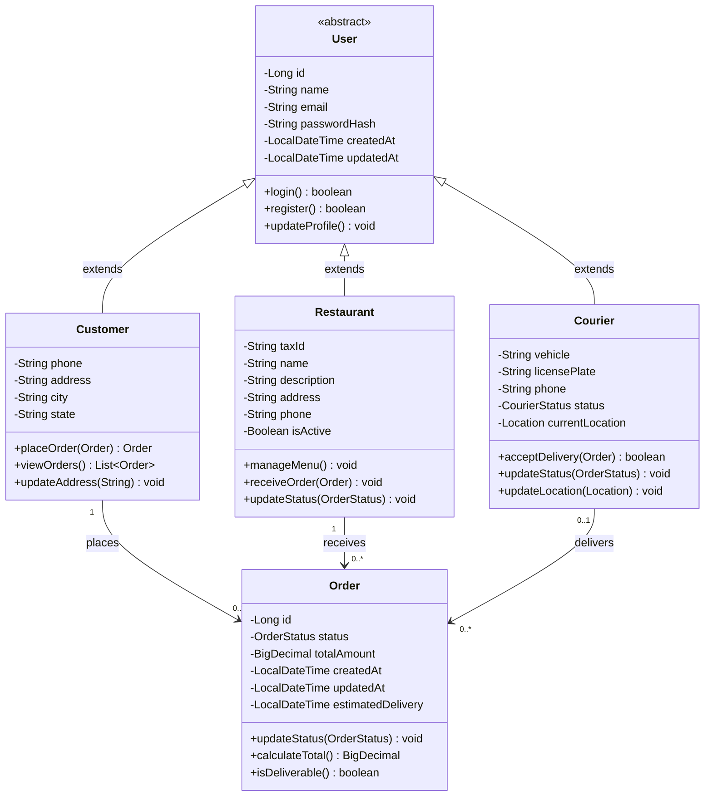
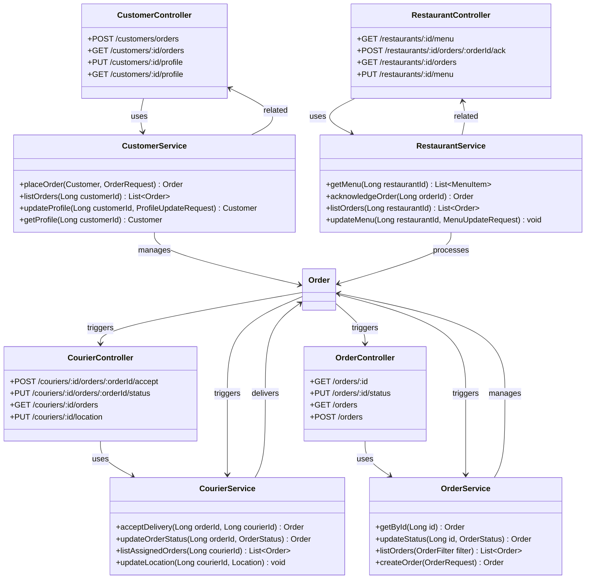
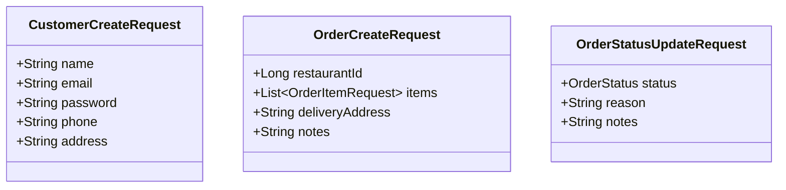
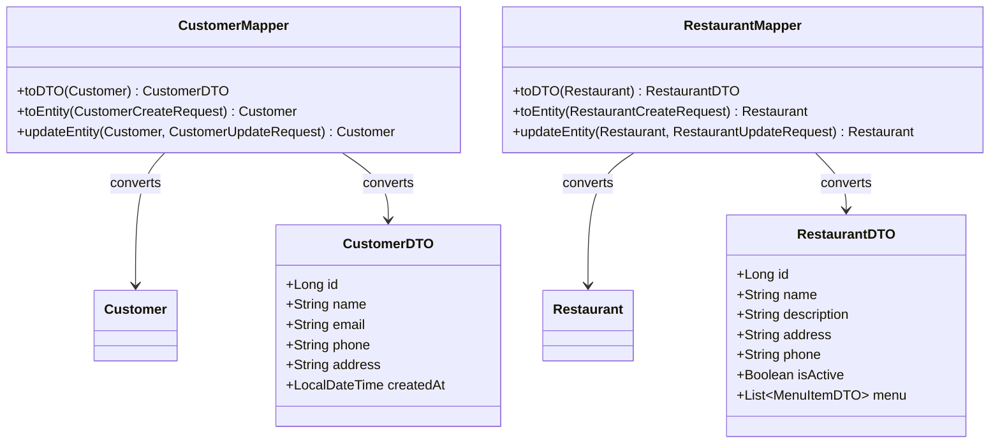
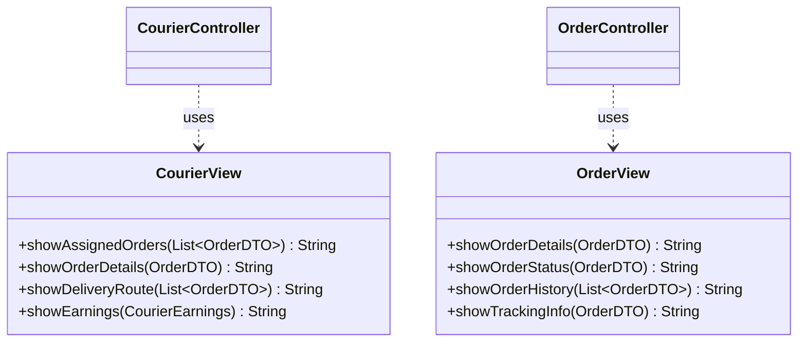
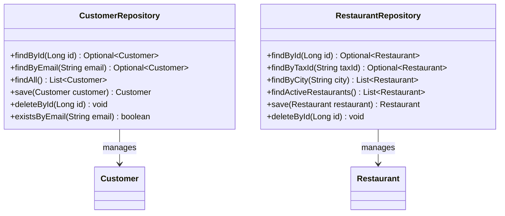
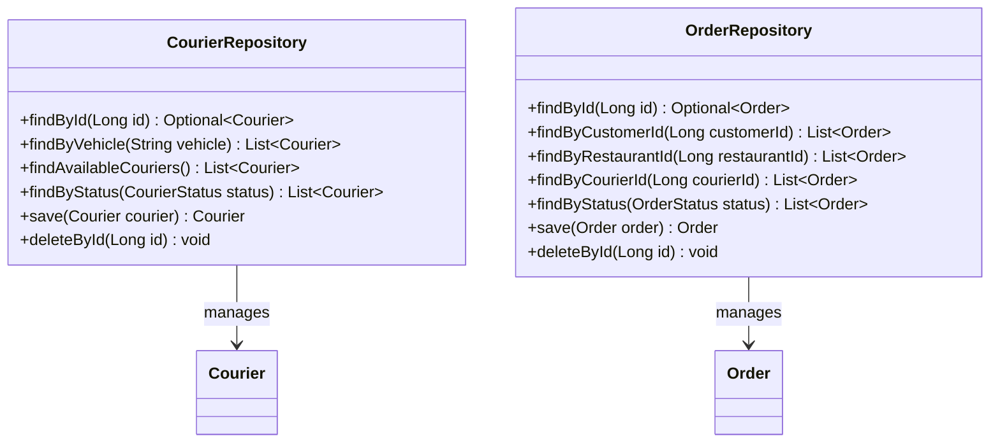
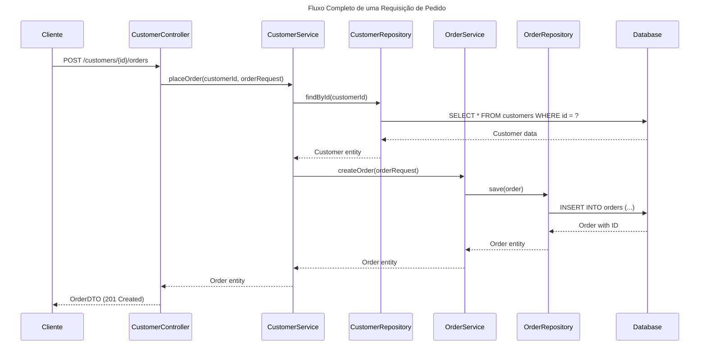

# 🚀 Arquitetura da API de Delivery

## 📋 Visão Geral
Este documento descreve a arquitetura completa de uma API de delivery, incluindo entidades, serviços, controladores e padrões utilizados.

---

## 1️⃣ **Entidades e Herança (Models + Inheritance)**

### 📊 Diagrama de Classes


### 🔍 **Explicação das Entidades:**
- **User**: Classe abstrata base com dados comuns (nome, email, senha)
- **Customer**: Cliente que faz pedidos
- **Restaurant**: Restaurante que recebe e processa pedidos
- **Courier**: Entregador que aceita e entrega pedidos
- **Order**: Pedido central que conecta todas as entidades

---

## 2️⃣ **Camada de Serviços e Controladores**

### 📊 Arquitetura de Controllers e Services


### 🔍 **Explicação da Arquitetura:**
- **Controllers**: Recebem requisições HTTP e delegam para Services
- **Services**: Contêm toda a lógica de negócio e validações
- **Separação de Responsabilidades**: Cada camada tem uma função específica

---

## 3️⃣ **DTOs e Mappers (Transferência de Dados)**

### 📊 Estrutura de DTOs e Mappers



```mermaid
classDiagram
    %% DTOs de Saída (Responses)
    class CourierDTO {
        +Long id
        +String name
        +String vehicle
        +String licensePlate
        +CourierStatus status
        +Location currentLocation
    }
    
    class OrderDTO {
        +Long id
        +OrderStatus status
        +BigDecimal totalAmount
        +LocalDateTime createdAt
        +LocalDateTime estimatedDelivery
        +CustomerDTO customer
        +RestaurantDTO restaurant
        +CourierDTO courier
        +List~OrderItemDTO~ items
    }

    %% Mappers
    class CourierMapper {
        +toDTO(Courier) CourierDTO
        +toEntity(CourierCreateRequest) Courier
        +updateEntity(Courier, CourierUpdateRequest) Courier
    }
    
    class OrderMapper {
        +toDTO(Order) OrderDTO
        +toEntity(OrderCreateRequest) Order
        +updateEntity(Order, OrderStatusUpdateRequest) Order
    }
    %% Relacionamentos
    CourierMapper --> Courier : converts
    CourierMapper --> CourierDTO : converts
    OrderMapper --> Order : converts
    OrderMapper --> OrderDTO : converts

````

### 🔍 **Explicação dos DTOs:**
- **Request DTOs**: Dados de entrada para criação/atualização
- **Response DTOs**: Dados de saída para o cliente
- **Mappers**: Convertem entre entidades e DTOs, mantendo separação de camadas

---

## 4️⃣ **Camada de Apresentação (Views)**

### 📊 Estrutura de Views
```mermaid
classDiagram
    title Camada de Apresentacao - Views
    
    %% Views para diferentes tipos de usuário
    class CustomerView {
        +showProfile(CustomerDTO) String
        +showOrders(List~OrderDTO~) String
        +showOrderDetails(OrderDTO) String
        +showRestaurantMenu(List~MenuItemDTO~) String
    }
    
    class RestaurantView {
        +showMenu(List~MenuItemDTO~) String
        +showIncomingOrders(List~OrderDTO~) String
        +showOrderDetails(OrderDTO) String
        +showAnalytics(RestaurantAnalytics) String
    }

    %% Relacionamentos com Controllers
    CustomerController ..> CustomerView : uses
    RestaurantController ..> RestaurantView : uses

```


### 🔍 **Explicação das Views:**
- **CustomerView**: Interface para clientes visualizarem pedidos e perfil
- **RestaurantView**: Interface para restaurantes gerenciarem pedidos e menu
- **CourierView**: Interface para entregadores acompanharem entregas
- **OrderView**: Interface genérica para visualização de pedidos

---

## 5️⃣ **Camada de Persistência (Repositories)**

### 📊 Estrutura de Repositories



### 🔍 **Explicação dos Repositories:**
- **CustomerRepository**: Gerencia persistência de clientes
- **RestaurantRepository**: Gerencia persistência de restaurantes
- **CourierRepository**: Gerencia persistência de entregadores
- **OrderRepository**: Gerencia persistência de pedidos

---

## 6️⃣ **Fluxo de Dados Completo**

### 📊 Fluxo de uma Requisição


---

## 7️⃣ **Padrões e Boas Práticas Utilizados**

### ✅ **Padrões de Projeto:**
- **MVC (Model-View-Controller)**: Separação clara de responsabilidades
- **Repository Pattern**: Abstração da camada de dados
- **Service Layer Pattern**: Lógica de negócio centralizada
- **DTO Pattern**: Transferência segura de dados entre camadas
- **Mapper Pattern**: Conversão entre entidades e DTOs

### ✅ **Princípios SOLID:**
- **Single Responsibility**: Cada classe tem uma responsabilidade
- **Open/Closed**: Extensível sem modificação
- **Liskov Substitution**: Herança bem implementada
- **Interface Segregation**: Interfaces específicas para cada necessidade
- **Dependency Inversion**: Dependências através de abstrações

### ✅ **Estrutura de Pacotes Recomendada:**
```
com.deliverytech.delivery/
├── controller/          # Controladores REST
├── service/            # Lógica de negócio
├── repository/         # Acesso a dados
├── model/             # Entidades JPA
├── dto/               # Objetos de transferência
├── mapper/            # Conversores
├── config/            # Configurações
├── exception/         # Exceções customizadas
└── util/              # Utilitários
```

---

## 🎯 **Próximos Passos para Implementação:**

1. **Configurar projeto Spring Boot** com dependências necessárias
2. **Implementar entidades JPA** com anotações apropriadas
3. **Criar repositories** com Spring Data JPA
4. **Implementar services** com lógica de negócio
5. **Criar controllers REST** com endpoints documentados
6. **Implementar DTOs e mappers** para transferência de dados
7. **Adicionar validações** e tratamento de exceções
8. **Configurar banco de dados** e migrations
9. **Implementar testes unitários** e de integração
10. **Documentar API** com Swagger/OpenAPI

---

*📝 Este diagrama serve como base para implementação de uma API de delivery robusta e escalável.*